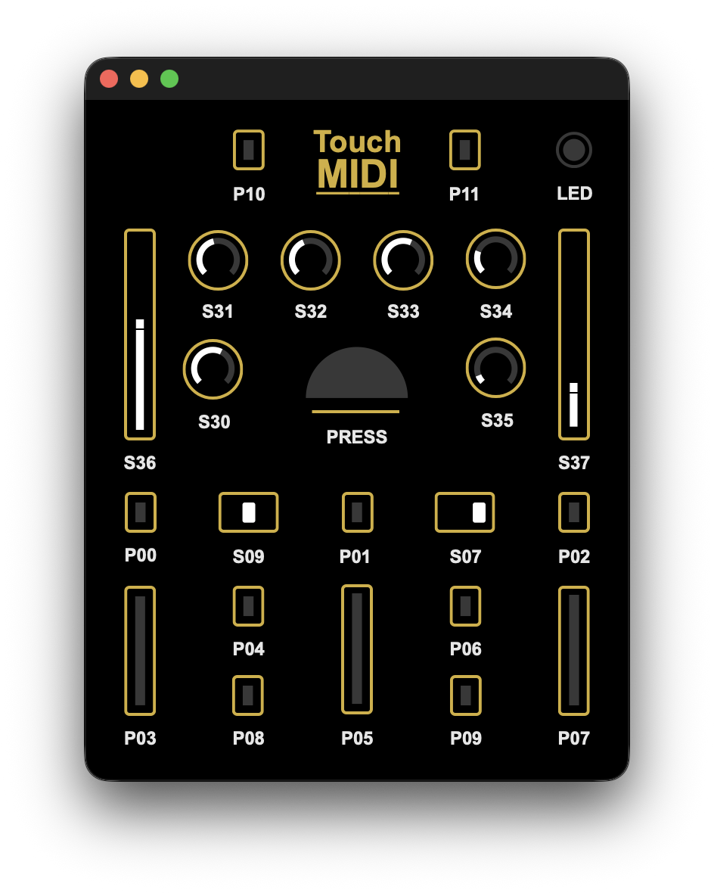

# Max Template

The patch shows every control in the Simple Touch layout. Each control has an editable label, set to its panel name by default.

## Connection

Open `TouchMIDI.maxpat` with the Touch connected over USB. The patch polls the MIDI device list (`midiinfo @autopollcontrollers 1`). When a port named `TouchMIDI` appears, it connects `midiin` and `midiout` to it and requests a state dump (CC113), so knobs, faders and switches show their current positions. Click **refresh midi** to search again.

If you rename the device in `config.h`, change the `TouchMIDI` message inside `p midiinfo` to match.

## Receive

Names follow the labels printed on the Simple Touch panel (see `touch.jpeg`). Use them with `[r ...]` in any open patch.

| Name | Control | Value |
|---|---|---|
| `P00` ... `P11` | Pads | Note velocity, 0 on release |
| `P00P` ... `P11P` | Pads | Pressure 0-127 (Poly Aftertouch) |
| `TOUCH` | Pads P00, P02-P09 | Combined pressure 0-127 |
| `ACTIVE` | Pads P00, P02-P09 | 1 while any pressure is applied |
| `S30` ... `S35` | Knobs | 0-127 |
| `S36`, `S37` | Left, right fader | 0-127 |
| `S09`, `S07` | Left (S09/S10), right (S07/S08) switch | 0 center, 1 down, 2 up |

## Send

| Name | MIDI | Action |
|---|---|---|
| `LED` | CC111 | 1 = on, 0 = off |
| `DUMP` | CC113 | Any message requests all knob, fader and switch values |

The **rebase pressure** button sends CC112, which recalibrates the touch baseline. The firmware ignores the value of CC112 and CC113.
